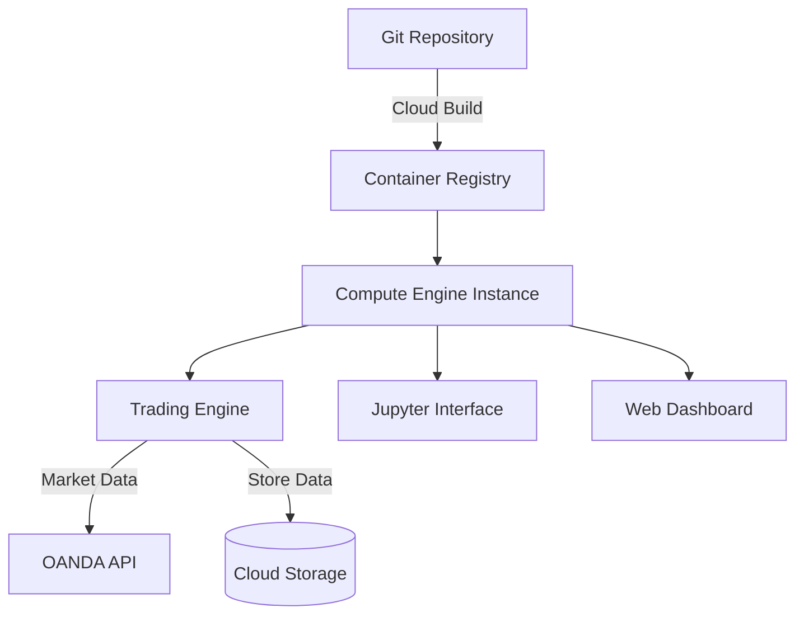

# Forex Trading System Master Plan

## 1. System Overview
A reinforcement learning-based Forex trading system capable of training, backtesting, and live trading across 15 currency pairs. The system includes automated model retraining, comprehensive performance monitoring, and a web-based dashboard for real-time visualization.

### Core Objectives
- Automated trading using PPO algorithms for 15 currency pairs
- Real-time performance monitoring and visualization
- Automated and manual model retraining capabilities
- Efficient deployment on Google Cloud Platform
- Comprehensive data management and preprocessing pipeline

## 2. System Architecture

### 2.1 Data Management Layer
```
📁 data_management/
├── dataset_manager.py      # Handles data loading, caching, and updates
├── data_fetcher.py        # OANDA API integration
├── preprocessor.py        # Data normalization and feature engineering
└── indicator_manager.py   # Technical indicator calculation
```

#### Key Components:
- **Dataset Manager**: Maintains historical and live data streams
- **Data Fetcher**: Handles OANDA API interactions
- **Preprocessor**: Manages data normalization and preparation
- **Indicator Manager**: Calculates and manages technical indicators

#### Indicator Configuration System
```yaml
# config/indicators.yaml
indicators:
  ichimoku:
    enabled: true
    params:
      conversion_line_period: 9
      base_line_period: 26
      lagging_span_period: 52
      displacement: 26
    visualize: true
  rsi:
    enabled: true
    params:
      period: 14
      overbought: 70
      oversold: 30
    visualize: true
  # ... additional indicators
```

### 2.2 Trading Engine
```
📁 trading/
├── environments/
│   ├── base_env.py        # Abstract base environment
│   └── forex_env.py       # Concrete trading environment
├── agents/
│   ├── base_agent.py      # Abstract agent class
│   ├── training_agent.py  # Training implementation
│   └── live_agent.py      # Live trading implementation
└── model_manager.py       # Model versioning and transitions
```

#### Model Retraining System
- **Automatic Triggers**:
  - Maximum drawdown exceeds threshold (configurable)
  - Win rate drops below minimum threshold (configurable)
- **Manual Triggers**:
  - API endpoint for manual retraining initiation
  - Web interface control

#### Model Transition Strategy
1. Train new model version while current model continues trading
2. Validate new model through backtesting
3. If performance metrics improve:
   - Schedule transition during low-volume period
   - Graceful shutdown of old model
   - Startup of new model with state transfer
4. If performance doesn't improve, retain current model

### 2.3 Monitoring and Visualization
```
📁 frontend/
├── dashboard/
│   ├── components/
│   │   ├── trading_chart.jsx
│   │   ├── performance_metrics.jsx
│   │   └── indicator_panels.jsx
│   └── pages/
│       ├── overview.jsx
│       ├── pair_detail.jsx
│       └── settings.jsx
└── api/
    └── websocket_handler.py
```

#### Dashboard Features
1. Overview Page:
   - Summary cards for all 15 currency pairs
   - Key metrics (PnL, win rate, drawdown)
   - Active positions and pending orders

2. Pair Detail Page:
   - Advanced charting with candlesticks
   - Technical indicator overlays
   - Trade entry/exit markers
   - Performance metrics
   - Order history

3. Settings Page:
   - Indicator configuration
   - Risk parameters
   - Model retraining controls

### 2.4 Deployment Architecture



#### GCP Setup
1. **Compute Engine Instance**:
   - e2-standard-4 (4 vCPU, 16 GB memory)
   - Ubuntu 20.04 LTS
   - 100 GB SSD persistent disk

2. **Docker Configuration**:
```yaml
services:
  trading-engine:
    build: ./trading
    volumes:
      - data:/app/data
    env_file: .env

  dashboard:
    build: ./frontend
    ports:
      - "3000:3000"
    depends_on:
      - trading-engine
```

3. **Deployment Pipeline**:
   - GitHub Actions for CI/CD
   - Automated testing before deployment
   - Rolling updates for zero-downtime deployment

## 3. Development Phases

### Phase 1: Core Infrastructure (2-3 weeks)
- Set up GCP environment
- Implement data management layer
- Create basic trading environment
- Establish CI/CD pipeline

### Phase 2: Trading Engine (3-4 weeks)
- Implement trading agents
- Develop model training pipeline
- Create backtesting framework
- Build model transition system

### Phase 3: Monitoring & Visualization (2-3 weeks)
- Develop web dashboard
- Implement real-time charting
- Create performance monitoring
- Build indicator visualization

### Phase 4: Testing & Optimization (2-3 weeks)
- Comprehensive system testing
- Performance optimization
- Documentation
- User acceptance testing

## 4. Risk Mitigation

### Technical Risks
1. **Data Management**:
   - Implement robust error handling for API failures
   - Regular data integrity checks
   - Automated data backup system

2. **Model Performance**:
   - Extensive backtesting before deployment
   - Gradual transition to new models
   - Performance monitoring with alerts

3. **System Stability**:
   - Resource monitoring and auto-scaling
   - Automated system health checks
   - Failover procedures

## 5. Future Enhancements

1. **Scalability Improvements**:
   - Kubernetes migration for multi-instance deployment
   - Distributed training capabilities
   - Advanced caching mechanisms

2. **Feature Additions**:
   - Additional technical indicators
   - Advanced risk management features
   - Portfolio optimization algorithms

3. **Infrastructure Upgrades**:
   - Real-time analytics pipeline
   - Advanced monitoring tools
   - Automated system optimization

## 6. Monitoring and Maintenance

### Regular Maintenance Tasks
1. Daily:
   - Data integrity checks
   - Performance metric monitoring
   - System health verification

2. Weekly:
   - Model performance review
   - System resource optimization
   - Backup verification

3. Monthly:
   - Comprehensive system audit
   - Performance optimization
   - Security updates

### Performance Metrics
1. Trading Metrics:
   - Win rate (target: >55%)
   - Maximum drawdown (limit: 20%)
   - Sharpe ratio
   - Risk-adjusted returns

2. System Metrics:
   - API response times
   - Model inference latency
   - Resource utilization
   - System uptime

## 7. Development Guidelines

### Code Structure
- Modular design with clear separation of concerns
- Comprehensive documentation
- Type hints and docstrings
- Unit tests for critical components

### Best Practices
- Regular code reviews
- Automated testing
- Version control for all components
- Comprehensive logging
- Error handling and recovery procedures

### Configuration Management
- Environment-specific configurations
- Secure credential management
- Feature flags for gradual rollout
